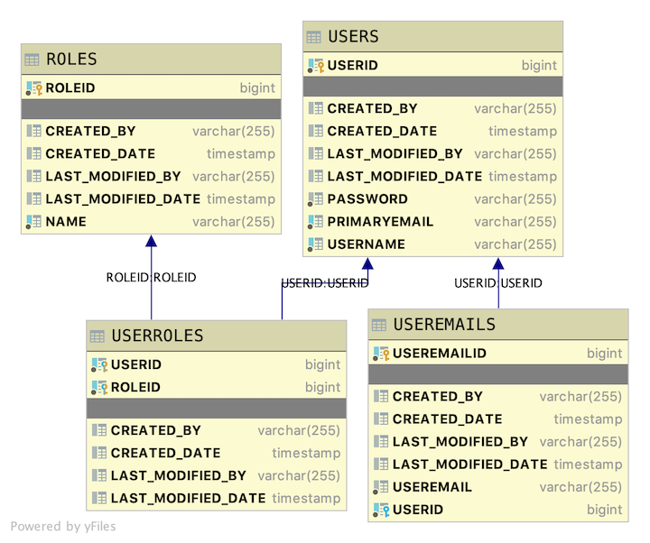

# Java User Model Exceptions

A student that completes this project shows that they can:

- Implement industry-standard exception handling including user-friendly exception messages
- Implement exception handling using a variety of Java constructs
- Use data validation annotations to verify data prior to processing the data
- Implement custom Swagger Documentation
- Gather and use data from other APIs

## Introduction

This is a basic database scheme with users, user emails, and user roles. This Java Spring REST API application will provide endpoints for clients to perform the various CRUD operations on data sets contained in the application's data.

### Database layout

The table layout is as follows

- User is the driving table.
- Useremails have a Many-To-One relationship with User. Each User has many user email combinations. Each user email combination has only one User.
- Roles have a Many-To-Many relationship with Users.

Two different applications exist

- usermodel_initial - This is the initial application to which we will add the "bells and whistles" related to exception handling, custom swagger documentation, and accessing other API's data.
- usermodel - the finished version with many "bells and whistles" added. Note that a few additions to the application seem "forced" or out of place. These are done specifically to show how to use certain commands!
